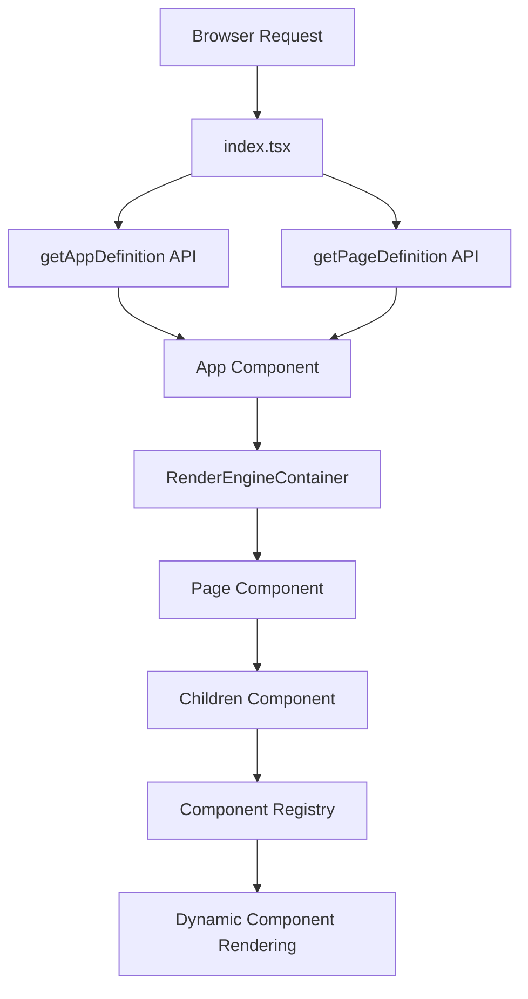

# Architecture Overview

## System Description

The nocode UI system is a React-based rendering engine that dynamically renders applications and websites based on JSON definitions fetched from APIs. The system operates entirely on definitions - no hardcoded pages or components. Everything is defined in MongoDB and fetched at runtime.

## High-Level Architecture



## Initialization Flow

### 1. Entry Point (`index.tsx`)

The application starts in `ui-app/client/src/index.tsx`:

1. **Location Processing**: Extracts page name from URL using `processLocation()`
2. **Definition Fetching**:
   - If page name exists: Fetches both application and page definitions in parallel
   - If no page name: Fetches application definition first, then gets default page
3. **React Rendering**: Renders `App` and `AppStyle` components
4. **Store Initialization**: Initializes global store with fetched definitions

Key code from `index.tsx`:

```typescript
const pageName = processLocation(window.location)?.pageName;

let appDefinitionResponse, pageDefinitionResponse;
if (pageName) {
  [appDefinitionResponse, pageDefinitionResponse] = await Promise.all([
    getAppDefinition(),
    getPageDefinition(pageName),
  ]);
} else {
  appDefinitionResponse = await getAppDefinition();
  pageDefinitionResponse = await getPageDefinition(
    appDefinitionResponse?.application?.properties?.defaultPage
  );
}
```

### 2. Application Component (`App.tsx`)

Located at `ui-app/client/src/App/App.tsx`:

- Sets up React Router with BrowserRouter
- Renders `RenderEngineContainer` for all routes (`/*`)
- Handles application-level concerns:
  - Font packs and icon packs loading
  - Meta tags, links, and scripts from application properties
  - Code parts injection (before/after head/body)
  - Device type detection and window size tracking
  - Messages component for notifications

### 3. Render Engine Container (`RenderEngineContainer.tsx`)

Located at `ui-app/client/src/Engine/RenderEngineContainer.tsx`:

- **Page Loading**: Determines which page to load based on URL
- **Shell Page Support**: Handles shell pages that wrap content
- **Page Definition Management**:
  - Loads page definitions from store or API
  - Processes CSS classes for page definitions
  - Handles page title and SEO meta tags
- **Event Execution**: Runs `onLoadEvent` for shell pages and applications
- **Design Mode Support**: Listens for editor messages in design mode

Key responsibilities:

- URL parameter extraction and processing
- Page definition caching in store
- Shell page wrapping logic
- Title and SEO management

### 4. Page Component (`Page.tsx`)

Located at `ui-app/client/src/components/Page/Page.tsx`:

- Renders the actual page content
- Manages page-level state and lifecycle
- Handles page `onLoadEvent` execution
- Processes page-level CSS classes
- Renders children components via `Children` component
- Handles authentication redirects if needed

### 5. Children Component (`Children.tsx`)

Located at `ui-app/client/src/components/Children.tsx`:

- **Component Resolution**: Looks up components from registry by type
- **Visibility Filtering**: Filters components based on visibility conditions
- **Ordering**: Sorts components by `displayOrder` and key
- **Recursive Rendering**: Creates React elements for each component
- **Nested Pages**: Handles nested Page components (SubPages)

## Key Concepts

### Application Definition

The application definition contains:

- Application metadata (appCode, clientCode)
- Application properties (title, defaultPage, shellPage, etc.)
- Theme and style references
- Font packs and icon packs
- Links, scripts, and meta tags
- CSP (Content Security Policy) settings
- Manifest for PWA support

Fetched from: `api/ui/application`

### Page Definition

The page definition contains:

- Page metadata (name, appCode, clientCode, version)
- Root component key
- Component definitions (tree structure)
- Event functions
- Translations
- Page properties (title, SEO, onLoadEvent, loadStrategy)
- CSS classes

Fetched from: `api/ui/page/{pageName}`

### Component Definition

Each component definition includes:

- `key`: Unique identifier
- `type`: Component type (Button, Text, Grid, etc.)
- `name`: Display name
- `properties`: Component properties (values or data locations)
- `styleProperties`: Responsive style properties
- `children`: Child component keys
- `displayOrder`: Rendering order
- `validations`: Validation rules

## Data Flow

1. **Request**: Browser requests a URL
2. **Location Processing**: Extract page name and parameters
3. **Definition Fetch**: Get application and page definitions from API
4. **Store Population**: Store definitions in reactive store
5. **Component Resolution**: Resolve component types from registry
6. **Property Resolution**: Resolve property values using data locations
7. **Style Processing**: Process responsive styles and pseudo-states
8. **Rendering**: Render React components recursively
9. **Event Execution**: Execute onLoad events
10. **Reactivity**: Listen to store changes for updates

## Store Architecture

The system uses a reactive store with multiple extractors:

- **Store**: Global application store (`Store.`)
- **Page**: Page-scoped data (`Page.`)
- **Url**: URL parameters (`Url.`)
- **LocalStore**: Browser localStorage (`LocalStore.`)
- **Theme**: Theme variables (`Theme.`)
- **Filler**: Filler values (`Filler.`)
- **SampleDataStore**: Sample data (`SampleDataStore.`)

See [06-state-management.md](06-state-management.md) for details.

## Component Registry

Components are registered in `ui-app/client/src/components/index.ts`:

- Each component exports a `Component` interface
- Components are stored in a Map by name
- Components include: React component, style component, properties, validations

Available components include:

- Layout: Grid, SectionGrid, Page, SubPage
- Form Inputs: TextBox, TextArea, Dropdown, CheckBox, RadioButton, etc.
- Display: Text, Image, Video, Icon, Table, Chart
- Interactive: Button, Link, Menu, Popup, Popover
- And many more...

See [03-component-system.md](03-component-system.md) and [10-component-reference.md](10-component-reference.md) for details.

## Design Mode

The system supports a design mode where:

- The UI runs in an iframe
- An external editor communicates via postMessage
- Definitions can be updated in real-time
- Components can be selected and edited
- Changes are synchronized between editor and preview

## File Structure

```
ui-app/client/src/
├── index.tsx                    # Entry point
├── App/
│   ├── App.tsx                 # Main app component
│   └── appDefinition.ts        # App definition fetching
├── Engine/
│   ├── RenderEngineContainer.tsx  # Page rendering engine
│   └── pageDefinition.ts       # Page definition fetching
├── components/
│   ├── index.ts                # Component registry
│   ├── Page/                   # Page component
│   ├── Children.tsx            # Children renderer
│   └── [ComponentName]/        # Individual components
├── context/
│   └── StoreContext.ts         # Store management
├── types/
│   └── common.ts               # TypeScript interfaces
└── functions/                  # Built-in functions
```

## Next Steps

- [02-application-and-page-definitions.md](02-application-and-page-definitions.md) - Detailed definition structures
- [03-component-system.md](03-component-system.md) - Component system details
- [09-rendering-flow.md](09-rendering-flow.md) - Detailed rendering process
