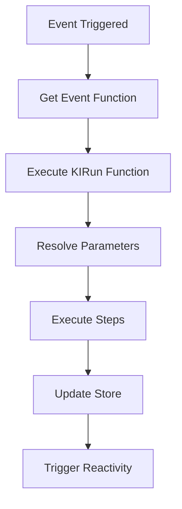

# Event System

## Overview

The event system allows components and pages to execute functions (KIRun functions) in response to user interactions or lifecycle events. Events are defined in page definitions and executed via the `runEvent` function.

## Event Functions Structure

Event functions are stored in the page definition's `eventFunctions` object:

```typescript
interface PageDefinition {
  eventFunctions: {
    [key: string]: any; // KIRun function definition
  };
  properties: {
    onLoadEvent?: string; // Event key to run on page load
  };
}
```

## Event Function Definition

Event functions are KIRun function definitions with steps:

```typescript
interface EventFunction {
  name: string; // Function name
  namespace?: string; // Namespace
  steps: {
    [stepKey: string]: {
      statementName: string;
      name: string; // Function name (e.g., "SetStore", "Navigate")
      namespace: string; // Namespace (e.g., "UIEngine")
      position?: { left: number; top: number };
      parameterMap: {
        [paramName: string]: {
          [key: string]: {
            key: string;
            type: "VALUE" | "EXPRESSION";
            value?: string;
            expression?: string;
            order: number;
          };
        };
      };
    };
  };
}
```

## Real Example from Samples

```json
{
  "eventFunctions": {
    "6QIUfhiy7GR4jhKwgytk11": {
      "name": "getstarted_mouseenter",
      "steps": {
        "setStore": {
          "statementName": "setStore",
          "name": "SetStore",
          "namespace": "UIEngine",
          "parameterMap": {
            "path": {
              "5PSpx42k9jrRYzzbWmMiHL": {
                "key": "5PSpx42k9jrRYzzbWmMiHL",
                "type": "VALUE",
                "order": 1,
                "value": "Page.getStartedHover"
              }
            },
            "value": {
              "6axWe8QCC7Vlg5Wy9VmY9w": {
                "key": "6axWe8QCC7Vlg5Wy9VmY9w",
                "type": "EXPRESSION",
                "expression": "true",
                "order": 1
              }
            }
          }
        }
      }
    }
  }
}
```

## Running Events

Events are executed via `runEvent`:

```typescript
async function runEvent(
  eventFunction: any,
  eventName: string,
  pageName: string,
  locationHistory: Array<LocationHistory>,
  pageDefinition: PageDefinition
): Promise<any>;
```

### Usage in Components

```typescript
const clickEvent = onClick
  ? props.pageDefinition.eventFunctions?.[onClick]
  : undefined;

if (clickEvent) {
  await runEvent(
    clickEvent,
    "onClick",
    props.context.pageName,
    props.locationHistory,
    props.pageDefinition
  );
}
```

## Page Lifecycle Events

### onLoadEvent

Runs when a page loads:

```typescript
properties: {
  onLoadEvent: "37e6zV5DhRrmiLq4qW4dTU"; // Event function key
}
```

Execution flow:

1. Page loads
2. `onLoadEvent` key is checked
3. Event function is retrieved from `eventFunctions`
4. Event is executed via `runEvent`

### Load Strategy

Controls when `onLoadEvent` runs:

- `default`: Runs only on first load (when page name changes)
- `always`: Runs every time page is visited
- `once`: Runs once per session

```typescript
properties: {
    onLoadEvent: "loadEvent",
    loadStrategy: "always"
}
```

## Application onLoadEvent

Shell pages can have `onLoadEvent` that runs when the application loads:

```typescript
// In shell page definition
properties: {
  onLoadEvent: "appOnLoadEvent";
}
```

This runs even if the shell page is not directly loaded.

## Component Events

Components can trigger events:

### Button onClick

```json
{
  "type": "Button",
  "properties": {
    "onClick": { "value": "buttonClickEvent" }
  }
}
```

### Form onSubmit

```json
{
  "type": "Form",
  "properties": {
    "onSubmit": { "value": "formSubmitEvent" }
  }
}
```

### Other Event Properties

Components can have various event properties:

- `onClick`: Click event
- `onSubmit`: Form submit
- `onChange`: Value change
- `onMouseEnter`: Mouse enter
- `onMouseLeave`: Mouse leave
- `onFocus`: Focus event
- `onBlur`: Blur event

## Event Context

Events have access to:

1. **Store**: `Store.*` paths
2. **Page Data**: `Page.*` paths
3. **URL Data**: `Url.*` paths
4. **Parent Context**: `Parent.*` paths (for nested components)
5. **Location History**: For accessing parent component data

## Event Execution Flow



## Built-in Event Functions

Events typically use built-in functions from `UIEngine` namespace:

- **SetStore**: Set store value
- **GetStoreData**: Get store value
- **Navigate**: Navigate to page
- **FetchData**: Fetch data from API
- **SendData**: Send data to API
- **Message**: Show message
- **Login**: Login user
- **Logout**: Logout user

See [08-functions-and-actions.md](08-functions-and-actions.md) for complete list.

## Event Examples

### Simple Store Update

```json
{
  "name": "updateCounter",
  "steps": {
    "setStore": {
      "name": "SetStore",
      "namespace": "UIEngine",
      "parameterMap": {
        "path": {
          "param1": {
            "type": "VALUE",
            "value": "Page.counter",
            "order": 1
          }
        },
        "value": {
          "param2": {
            "type": "EXPRESSION",
            "expression": "Page.counter + 1",
            "order": 1
          }
        }
      }
    }
  }
}
```

### Navigation Event

```json
{
  "name": "goToHome",
  "steps": {
    "navigate": {
      "name": "Navigate",
      "namespace": "UIEngine",
      "parameterMap": {
        "pageName": {
          "param1": {
            "type": "VALUE",
            "value": "home",
            "order": 1
          }
        }
      }
    }
  }
}
```

### Fetch Data Event

```json
{
  "name": "loadUsers",
  "steps": {
    "fetchData": {
      "name": "FetchData",
      "namespace": "UIEngine",
      "parameterMap": {
        "url": {
          "param1": {
            "type": "VALUE",
            "value": "/api/users",
            "order": 1
          }
        },
        "method": {
          "param2": {
            "type": "VALUE",
            "value": "GET",
            "order": 1
          }
        },
        "storePath": {
          "param3": {
            "type": "VALUE",
            "value": "Page.users",
            "order": 1
          }
        }
      }
    }
  }
}
```

## Event Execution State

Events track execution state:

```typescript
Store.functionExecutions.{pageName}.{eventKey} = {
    isRunning: boolean;
    result?: any;
    error?: any;
}
```

Components can check if an event is running:

```typescript
const spinnerPath = onClick
  ? `Store.functionExecutions.${pageName}.${flattenUUID(onClick)}.isRunning`
  : undefined;

const [isLoading, setIsLoading] = useState(
  getDataFromPath(spinnerPath, locationHistory, pageExtractor) ?? false
);
```

## Parent Context in Events

For nested components (e.g., ArrayRepeater items), events have access to parent context:

```typescript
// In ArrayRepeater item
const locationHistory: LocationHistory[] = [
  {
    location: { type: "VALUE", value: "Store.items" },
    index: 0,
    pageName: "home",
    componentKey: "repeater-1",
  },
];

// Event can access parent:
// Parent.name resolves to parent item's name
```

## Related Documents

- [08-functions-and-actions.md](08-functions-and-actions.md) - Available functions
- [06-state-management.md](06-state-management.md) - Store system
- [09-rendering-flow.md](09-rendering-flow.md) - Rendering and lifecycle
