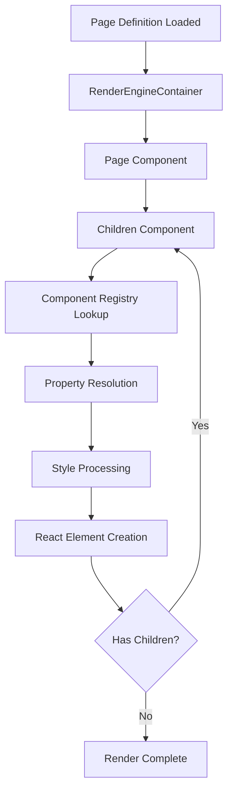

# Rendering Flow

## Overview

The rendering flow describes how page definitions are transformed into React components and rendered in the browser. The process is recursive and handles component resolution, property resolution, style processing, and child rendering.

## High-Level Flow



## Step-by-Step Process

### 1. Page Definition Loading

Location: `Engine/RenderEngineContainer.tsx`

1. URL is processed to extract page name
2. Page definition is fetched from API or retrieved from store
3. CSS classes are processed
4. Page definition is set in state

```typescript
const loadDefinition = useCallback(() => {
  const details = processLocation(window.location);
  let { pageName } = details;

  if (!pageName) {
    pageName = getDataFromPath(
      `${STORE_PREFIX}.application.properties.defaultPage`,
      []
    );
  }

  let pDef = getDataFromPath(`${STORE_PREFIX}.pageDefinition.${pageName}`, []);
  if (!pDef) {
    setData(
      `Store.pageDefinition.${pageName}`,
      await getPageDefinition(pageName!)
    );
    pDef = getDataFromPath(`${STORE_PREFIX}.pageDefinition.${pageName}`, []);
  }

  setPageDefinition(processClassesForPageDefinition(pDef));
}, [location]);
```

### 2. Page Component Rendering

Location: `components/Page/Page.tsx`

1. Page component receives page definition
2. Properties are resolved using `useDefinition`
3. Styles are processed
4. CSS classes are injected
5. Children are rendered via `Children` component

```typescript
function PageComponent(props: Readonly<ComponentProps>) {
  const { pageDefinition, definition, locationHistory, context } = props;

  const { stylePropertiesWithPseudoStates } = useDefinition(
    definition,
    propertiesDefinition,
    stylePropertiesDefinition,
    locationHistory,
    pageExtractor,
    urlExtractor
  );

  // Process styles
  const resolvedStyles = processComponentStylePseudoClasses(
    pageDefinition,
    {},
    stylePropertiesWithPseudoStates
  );

  // Render children
  return (
    <div className="comp compPage" style={resolvedStyles?.comp ?? {}}>
      <Children
        pageDefinition={pageDefinition}
        renderableChildren={{
          [pageDefinition.rootComponent]: true,
        }}
        context={context}
        locationHistory={locationHistory}
      />
    </div>
  );
}
```

### 3. Children Component Rendering

Location: `components/Children.tsx`

The `Children` component handles rendering of child components:

1. **Filter Visible Children**: Filters children based on visibility conditions
2. **Sort Children**: Sorts by `displayOrder` and key
3. **Resolve Components**: Looks up components from registry
4. **Create React Elements**: Creates React elements for each child
5. **Recursive Rendering**: Recursively renders nested children

```typescript
function Children({
    pageDefinition,
    renderableChildren,
    context,
    locationHistory,
}: Readonly<{
    pageDefinition: PageDefinition;
    renderableChildren: any;
    context: RenderContext;
    locationHistory: Array<LocationHistory>;
}>): JSX.Element {
    // Get component definitions
    const defs = Object.entries(renderableChildren ?? {})
        .filter(([, v]) => !!v)
        .map(([k]) => pageDefinition.componentDefinition[k])
        .filter(e => !!e?.properties?.visibility ? getData(e.properties.visibility, ...) : e)
        .sort((a: any, b: any) => {
            const v = (a?.displayOrder ?? 0) - (b?.displayOrder ?? 0);
            return v === 0 ? (a?.key ?? '').localeCompare(b?.key ?? '') : v;
        });

    return (
        <>
            {defs.map((e) => {
                let Comp = ComponentDefinitions.get(e.type)?.component;
                if (!Comp) Comp = Nothing.component;

                // Handle nested Page components
                if (e.type === 'Page') {
                    const pageDef = getOrLoadPageDefinition(location);
                    return <Page definition={e} pageDefinition={pageDef} ... />;
                }

                // Create React element
                return React.createElement(Comp, {
                    definition: e,
                    key: e.key,
                    pageDefinition: pageDefinition,
                    context: { ...context },
                    locationHistory: locationHistory,
                });
            })}
        </>
    );
}
```

### 4. Component Property Resolution

Location: `components/util/useDefinition/index.ts`

Each component uses `useDefinition` to resolve properties:

1. **Extractors Setup**: Creates token value extractors
2. **Path Extraction**: Extracts all store paths from properties
3. **Reactivity Setup**: Sets up listeners for paths
4. **State Creation**: Creates resolved state with values

```typescript
export default function useDefinition(
    definition: ComponentDefinition,
    properties: Array<ComponentPropertyDefinition>,
    stylePropertiesDefinition: ComponentStylePropertyDefinition,
    locationHistory: Array<LocationHistory>,
    pageExtractor: PageStoreExtractor,
    urlExtractor: UrlDetailsExtractor,
): ComponentDefinitionValues {
    // Setup extractors
    const evaluatorMaps = new Map<string, TokenValueExtractor>([
        [storeExtractor.getPrefix(), storeExtractor],
        [pageExtractor.getPrefix(), pageExtractor],
        [urlExtractor.getPrefix(), urlExtractor],
    ]);

    // Extract paths and setup reactivity
    useEffect(() => {
        let paths = getPathsFromComponentDefinition(definition, evaluatorMaps, propDefMap);

        return addListener(
            pageExtractor?.getPageName() ?? undefined,
            (p, v) => {
                const newState = createNewState(...);
                setCompState(newState);
            },
            ...paths,
        );
    }, [definition, ...]);

    return compState;
}
```

### 5. Style Processing

Location: `util/styleProcessor.ts`

Styles are processed to handle:

- Responsive breakpoints
- Pseudo-states
- Conditional styles
- CSS classes

```typescript
function processComponentStylePseudoClasses(
  pdef: PageDefinition,
  pseudoStates: { [key: string]: boolean },
  styleProperties: any
): any {
  let style = { ...styleProperties[""] }; // Start with default

  // Apply pseudo-state styles
  for (let [state, status] of Object.entries(pseudoStates)) {
    if (status && styleProperties[state]) {
      // Merge pseudo-state styles
      for (let [target, styleObj] of Object.entries(styleProperties[state])) {
        if (style[target]) {
          style[target] = { ...style[target], ...styleObj };
        } else {
          style[target] = styleObj;
        }
      }
    }
  }

  // Apply processed classes
  if (pdef.processedClasses) {
    // Merge CSS classes
  }

  return style;
}
```

## Component Rendering Order

Components are rendered in this order:

1. **Display Order**: Components with lower `displayOrder` render first
2. **Key Order**: If `displayOrder` is equal, components are sorted by key alphabetically
3. **Visibility**: Only visible components are rendered

```typescript
.sort((a: any, b: any) => {
    const v = (a?.displayOrder ?? 0) - (b?.displayOrder ?? 0);
    return v === 0 ? (a?.key ?? '').localeCompare(b?.key ?? '') : v;
});
```

## Visibility Filtering

Components can be conditionally visible:

```typescript
// Component with visibility
properties: {
    visibility: {
        location: {
            type: "EXPRESSION",
            expression: "Store.showMenu"
        }
    }
}

// Filtering in Children
.map(e => {
    if (!e?.properties?.visibility) return e;

    return getData(e.properties.visibility, locationHistory, pageExtractor, urlExtractor)
        ? e
        : undefined;
})
.filter(e => !!e);
```

## Location History

Location history tracks component nesting for parent access:

```typescript
interface LocationHistory {
  location: DataLocation | string;
  index: number | string;
  pageName: string;
  componentKey: string;
}
```

Example in ArrayRepeater:

```typescript
// For each item in array
locationHistory.push({
  location: { type: "VALUE", value: "Store.items" },
  index: i,
  pageName: "home",
  componentKey: "repeater-1",
});
```

## Component Key Generation

Component keys are UUIDs that are flattened for store paths:

```typescript
function flattenUUID(uuid: string): string {
  return uuid.replace(/-/g, "");
}
```

Keys are used for:

- React element keys
- Store paths
- Component identification

## Nested Page Rendering

Pages can be nested (SubPage component):

```typescript
if (e.type === "Page") {
  const pageDef = getOrLoadPageDefinition(location);
  if (pageDef) {
    return (
      <Page
        definition={e}
        pageDefinition={pageDef}
        key={pageDef.name}
        context={{
          pageName: pageDef.name,
          level: context.level + 1,
          shellPageName: context.pageName,
        }}
        locationHistory={[]}
      />
    );
  }
}
```

## Rendering Context Levels

Context levels prevent infinite nesting:

```typescript
if (
  context.level >= 2 ||
  (context.level > 0 && pageName === context.shellPageName)
) {
  return <div>Design Mode - Blocked Rendering</div>;
}
```

## Real Example Flow

1. **Page Loads**: `home` page definition loaded
2. **Root Component**: `rootComponent: "grid-1"` found
3. **Grid Renders**: Grid component renders with children
4. **Children Resolve**: Children `["text-1", "button-1"]` resolved
5. **Text Renders**: Text component renders with resolved text
6. **Button Renders**: Button component renders with onClick event
7. **Complete**: All components rendered

## Performance Considerations

- **Lazy Loading**: Components are code-split
- **Memoization**: Styles are memoized
- **Selective Updates**: Only changed paths trigger re-renders
- **Virtual Scrolling**: Large lists can use virtualization

## Related Documents

- [03-component-system.md](03-component-system.md) - Component system
- [04-property-system.md](04-property-system.md) - Property resolution
- [05-style-system.md](05-style-system.md) - Style processing
- [06-state-management.md](06-state-management.md) - Store and reactivity
