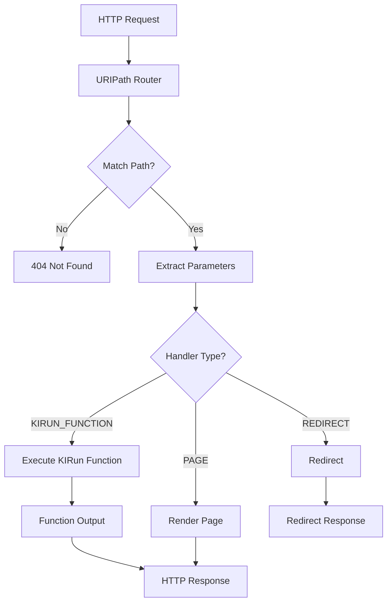

# Filler Values and URIPath Definitions

## Overview

This document covers two distinct but related features:

1. **Filler Values**: Global variables accessible throughout the application via `Filler.` prefix
2. **URIPath Definitions**: Custom API endpoints that route to KIRun functions

## Part 1: Filler Values

### What are Filler Values?

Filler values are application-wide global variables that can be used in:
- Component properties
- Style properties
- Event functions
- Data binding expressions

They are defined in the application definition and accessed using the `Filler.` prefix.

### Storage Location

Filler values are stored in:
- **Application Definition**: `application.properties.fillerValues`
- The filler extractor resolves `Filler.x` to `Store.application.properties.fillerValues.x`

### Filler Value Structure

```typescript
interface ApplicationProperties {
  fillerValues?: {
    [key: string]: any;  // Any serializable value
  };
}
```

### Defining Filler Values

In the application definition:

```json
{
  "properties": {
    "fillerValues": {
      "companyName": "My Company",
      "supportEmail": "support@example.com",
      "apiBaseUrl": "https://api.example.com",
      "appVersion": "1.0.0",
      "maxUploadSize": 10485760,
      "features": {
        "darkMode": true,
        "analytics": false,
        "notifications": true
      },
      "socialLinks": {
        "twitter": "https://twitter.com/mycompany",
        "linkedin": "https://linkedin.com/company/mycompany"
      }
    }
  }
}
```

### Using Filler Values

#### In Component Properties

```json
{
  "type": "Text",
  "properties": {
    "text": {
      "location": {
        "type": "EXPRESSION",
        "expression": "Filler.companyName"
      }
    }
  }
}
```

#### In Style Properties

```json
{
  "styleProperties": {
    "style1": {
      "resolutions": {
        "ALL": {
          "maxWidth": {
            "location": {
              "type": "EXPRESSION",
              "expression": "Filler.containerWidth"
            }
          }
        }
      }
    }
  }
}
```

#### In Event Functions

```json
{
  "steps": {
    "fetchData": {
      "name": "FetchData",
      "namespace": "UIEngine",
      "parameterMap": {
        "url": {
          "p1": {
            "type": "EXPRESSION",
            "expression": "Filler.apiBaseUrl + '/users'"
          }
        }
      }
    }
  }
}
```

### Common Use Cases

1. **Company/Brand Information**: Logo URLs, company name, taglines
2. **API Configuration**: Base URLs, API keys, endpoints
3. **Feature Flags**: Enable/disable features
4. **Application Settings**: Default values, limits, timeouts
5. **External Links**: Social media, documentation, support links
6. **Environment Configuration**: Environment-specific values

### Best Practices

1. **Naming Convention**: Use camelCase for consistency
2. **Organization**: Group related values in objects
3. **Types**: Use appropriate types (strings, numbers, booleans, objects)
4. **Documentation**: Comment complex filler configurations
5. **Security**: Don't store sensitive data (use secure backend)

---

## Part 2: URIPath Definitions

### What are URIPath Definitions?

URIPath definitions create custom API endpoints that route requests to KIRun functions. This enables:
- Custom REST API endpoints
- Server-side business logic execution
- Dynamic routing with path parameters

### Storage Location

URIPath definitions are stored in:
- **MongoDB Collection**: `uripath`
- **File Export**: `appbuilder-data/URIPath/`
- **Naming Convention**: `{id}.json` (using MongoDB ID)

### URIPath Definition Structure

```typescript
interface URIPathDocument {
  id: string;              // MongoDB ID
  createdAt: number;       // Unix timestamp
  createdBy: string;       // User ID
  updatedAt: number;       // Unix timestamp
  updatedBy: string;       // User ID
  name: string;            // Display name (with wildcards)
  message?: string;        // Optional message
  clientCode: string;      // Client code
  appCode: string;         // Application code
  version: number;         // Version number
  pathString: string;      // Actual path with {params}
  pathDefinitions: PathDefinitions;  // Handler definitions
}

interface PathDefinitions {
  GET?: PathHandler;
  POST?: PathHandler;
  PUT?: PathHandler;
  DELETE?: PathHandler;
  PATCH?: PathHandler;
}

interface PathHandler {
  uriType: "KIRUN_FUNCTION" | "PAGE" | "REDIRECT";
  kiRunFxDefinition?: KIRunFunctionDefinition;
  pageDefinition?: PageDefinition;
  redirectDefinition?: RedirectDefinition;
}

interface KIRunFunctionDefinition {
  name: string;            // Function name
  namespace: string;       // Function namespace
  pathParamMapping?: {     // Map path params to function params
    [pathParam: string]: string;  // pathParam -> functionParam
  };
  queryParamMapping?: {    // Map query params to function params
    [queryParam: string]: string;
  };
  bodyMapping?: string;    // Function parameter for request body
}
```

### Real Example

From `appbuilder-data/URIPath/6810846bc133de71dc109da7.json`:

```json
{
  "id": "6810846bc133de71dc109da7",
  "createdAt": 1745912939,
  "createdBy": "142",
  "updatedAt": 1759226440,
  "updatedBy": "142",
  "name": "/hello/*/*/C/B",
  "clientCode": "SYSTEM",
  "appCode": "appbuilder",
  "version": 6,
  "pathString": "/hello/{a}/{b}/C/B",
  "pathDefinitions": {
    "GET": {
      "uriType": "KIRUN_FUNCTION",
      "kiRunFxDefinition": {
        "name": "testFunction",
        "namespace": "appbuilder",
        "pathParamMapping": {
          "a": "aParam",
          "b": "bParam"
        }
      }
    },
    "POST": {
      "uriType": "KIRUN_FUNCTION",
      "kiRunFxDefinition": {
        "name": "testFunction",
        "namespace": "appbuilder",
        "pathParamMapping": {
          "a": "aParam",
          "b": "bParam"
        }
      }
    }
  }
}
```

### Path Parameter Syntax

Path parameters use curly braces:
- `/users/{id}` - Single parameter
- `/users/{userId}/posts/{postId}` - Multiple parameters
- `/api/{version}/data` - Mixed static and dynamic

The `name` field uses wildcards (`*`) for display, while `pathString` uses `{param}` for actual routing.

### Comprehensive URIPath Examples

#### Simple GET Endpoint

```json
{
  "name": "/users/*",
  "pathString": "/users/{id}",
  "pathDefinitions": {
    "GET": {
      "uriType": "KIRUN_FUNCTION",
      "kiRunFxDefinition": {
        "name": "getUser",
        "namespace": "UserService",
        "pathParamMapping": {
          "id": "userId"
        }
      }
    }
  }
}
```

#### CRUD Endpoints

```json
{
  "name": "/products/*",
  "pathString": "/products/{id}",
  "pathDefinitions": {
    "GET": {
      "uriType": "KIRUN_FUNCTION",
      "kiRunFxDefinition": {
        "name": "getProduct",
        "namespace": "ProductService",
        "pathParamMapping": {
          "id": "productId"
        }
      }
    },
    "PUT": {
      "uriType": "KIRUN_FUNCTION",
      "kiRunFxDefinition": {
        "name": "updateProduct",
        "namespace": "ProductService",
        "pathParamMapping": {
          "id": "productId"
        },
        "bodyMapping": "productData"
      }
    },
    "DELETE": {
      "uriType": "KIRUN_FUNCTION",
      "kiRunFxDefinition": {
        "name": "deleteProduct",
        "namespace": "ProductService",
        "pathParamMapping": {
          "id": "productId"
        }
      }
    }
  }
}
```

#### Collection Endpoint

```json
{
  "name": "/products",
  "pathString": "/products",
  "pathDefinitions": {
    "GET": {
      "uriType": "KIRUN_FUNCTION",
      "kiRunFxDefinition": {
        "name": "listProducts",
        "namespace": "ProductService",
        "queryParamMapping": {
          "page": "pageNumber",
          "limit": "pageSize",
          "category": "categoryFilter"
        }
      }
    },
    "POST": {
      "uriType": "KIRUN_FUNCTION",
      "kiRunFxDefinition": {
        "name": "createProduct",
        "namespace": "ProductService",
        "bodyMapping": "productData"
      }
    }
  }
}
```

#### Nested Resources

```json
{
  "name": "/users/*/orders/*",
  "pathString": "/users/{userId}/orders/{orderId}",
  "pathDefinitions": {
    "GET": {
      "uriType": "KIRUN_FUNCTION",
      "kiRunFxDefinition": {
        "name": "getUserOrder",
        "namespace": "OrderService",
        "pathParamMapping": {
          "userId": "customerId",
          "orderId": "orderNumber"
        }
      }
    }
  }
}
```

### Handler Types

#### KIRUN_FUNCTION

Routes to a KIRun function:

```json
{
  "uriType": "KIRUN_FUNCTION",
  "kiRunFxDefinition": {
    "name": "functionName",
    "namespace": "FunctionNamespace"
  }
}
```

#### PAGE (Page Rendering)

Routes to a page for server-side rendering:

```json
{
  "uriType": "PAGE",
  "pageDefinition": {
    "pageName": "productDetail",
    "pathParamMapping": {
      "id": "productId"
    }
  }
}
```

#### REDIRECT

Redirects to another URL:

```json
{
  "uriType": "REDIRECT",
  "redirectDefinition": {
    "url": "/new-path",
    "permanent": true
  }
}
```

### Request/Response Flow



### Best Practices

1. **RESTful Design**: Follow REST conventions for URLs
2. **Consistent Naming**: Use kebab-case for URL paths
3. **Version APIs**: Include version in path (`/api/v1/...`)
4. **Meaningful Params**: Use descriptive parameter names
5. **Error Handling**: Handle errors in KIRun functions
6. **Authentication**: Check auth in functions when needed

---

## Integration Example

### Complete Application Setup

```json
{
  "application": {
    "properties": {
      "fillerValues": {
        "apiPrefix": "/api/v1",
        "companyName": "Acme Corp"
      }
    }
  }
}
```

### Using Fillers with URIPath

In a page event function, call the custom API:

```json
{
  "steps": {
    "fetchProduct": {
      "name": "FetchData",
      "namespace": "UIEngine",
      "parameterMap": {
        "url": {
          "p1": {
            "type": "EXPRESSION",
            "expression": "Filler.apiPrefix + '/products/' + Page.selectedProductId"
          }
        }
      }
    }
  }
}
```

## Related Documents

- [02-application-and-page-definitions.md](02-application-and-page-definitions.md) - Application properties
- [06-state-management.md](06-state-management.md) - Store prefixes including Filler
- [19-function-definitions.md](19-function-definitions.md) - KIRun functions
- [08-functions-and-actions.md](08-functions-and-actions.md) - FetchData function

